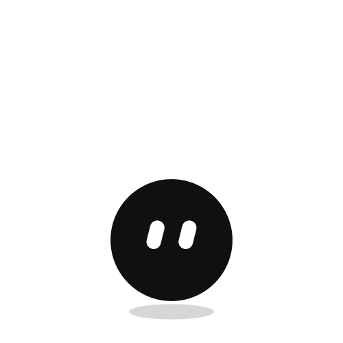
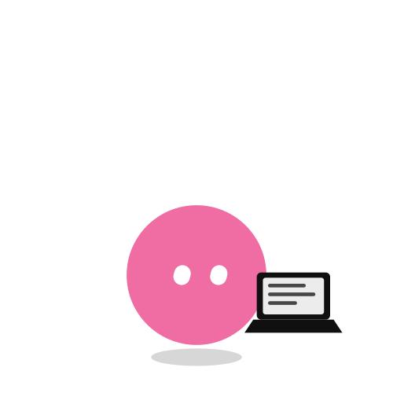

# まっくろくろすけ / Makkuro Kurosuke

A soot-sprite theme for [Clawd on Desk](https://github.com/rullerzhou-afk/clawd-on-desk) — the desktop pet that reacts to your Claude Code sessions in real time.

A flat black ball with two white eyes. No arms, no legs. Everything expressive happens in the eyes.

<p>
  
  
  
  
  
  
</p>

Every asset is hand-written, animated SVG. No sprite sheets, no APNG, no bitmaps — the whole theme is about 60 KB.

## The eyes

Each eye is a stadium shape whose corner radius is always half its width, so shrinking its height until it matches its width turns it into a true circle. That one trick lets the eyes morph smoothly between three shapes with nothing but CSS:

| | |
|---|---|
| **Slit** | the default, tilted slightly |
| **Round** | pops in every so often while idling |
| **Squint** | narrows in between, and while working |

While looking around, the pair also glides across the face and the two eyes scale against each other — the one heading around the curve reads as further away, which sells the face as sitting on a sphere.

## States

| State | Face |
|---|---|
| Idle | slits, drifting; occasionally round or squinting; follows your cursor |
| Working (1 session) | narrowed eyes, hunched at a laptop |
| Working (2 / 3+ sessions) | smiling, bouncing, music notes |
| Subagents | smiling, swaying like a conductor |
| Thinking | looking up, tangled scribbles overhead |
| Done / idea | smiling under a lightbulb, sparkles |
| Notification | round eyes, bouncing `!` |
| Error | `✕ ✕`, ERROR sign, sweat drop |
| Sleeping | settled into a puddle, `zzz` |
| Poke / drag | round-eyed startle / squeezed shut |
| Chill | sunglasses and a drink (rare idle animation) |

## Install

Drop this repo into your Clawd on Desk themes folder, then pick **まっくろくろすけ** from the tray menu.

**macOS**

```bash
git clone https://github.com/cathyakanerena07/makkurokurosuke-theme "$HOME/Library/Application Support/clawd-on-desk/themes/makkurokurosuke"
```

**Windows (PowerShell)**

```bash
git clone https://github.com/cathyakanerena07/makkurokurosuke-theme "$env:APPDATA\clawd-on-desk\themes\makkurokurosuke"
```

**Linux**

```bash
git clone https://github.com/cathyakanerena07/makkurokurosuke-theme "$HOME/.config/clawd-on-desk/themes/makkurokurosuke"
```

The folder name must be `makkurokurosuke`. Restart the app after cloning.

## Customizing

Every SVG is generated from one shared body definition in `build-assets.js`, so the character stays on-model across all 14 states. Change a knob near the top and regenerate:

```bash
node build-assets.js
```

| Knob | Default | What it does |
|---|---|---|
| `EYE_W` / `EYE_H` | 1.9 / 3.8 | slit width and height |
| `EYE_ROUND` | 3.3 | diameter when the eyes pop round |
| `EYE_DX` | 2.1 | gap between the eyes |
| `EYE_Y` | 5.8 | eye height on the face |
| `EYE_TILT` | 14 | slit lean, in degrees |
| `R` | 8.0 | body radius |

No dependencies — plain Node, no `npm install`.

## Credits

Built for [Clawd on Desk](https://github.com/rullerzhou-afk/clawd-on-desk) by rullerzhou-afk, which is licensed AGPL-3.0-only. This repository contains only original theme assets and their generator, released separately under the MIT License (see `LICENSE`).

Inspired by the soot sprites (susuwatari) of Studio Ghibli's films. This is unofficial fan art, not affiliated with or endorsed by Studio Ghibli.
